# ECG Monitor Architecture Documentation

## Quick Reference: Production Deployment

| Decision            | Recommendation                        | Impact                   | Cost        |
| ------------------- | ------------------------------------- | ------------------------ | ----------- |
| **Lambda Region**   | Same as Redis (us-east-1)             | Required for VPC access  | -           |
| **Lambda AZ**       | Force same AZ as Redis                | **Latency: 7ms → 4ms**   | -           |
| **Redis Instance**  | cache.r6g.large (10 Gbps networking)  | Sub-millisecond I/O      | $145/month  |
| **Redis AZ**        | Single AZ (with replica in different) | **Critical for latency** | -           |
| **VPC Endpoints**   | Enable for SQS                        | No NAT gateway cost      | $7.20/month |
| **Connection Pool** | Reuse across Lambda warm starts       | Save 50ms per cold start | -           |
| **Pipelining**      | Batch GET state + GET metadata        | 2 round-trips → 1        | -           |
| **Monitor**         | Cross-AZ traffic = 0%                 | Each GB costs $0.01      | -           |

**Total**: ~$895/month (Lambda + ElastiCache + VPC endpoints) for 1,000 patients  
**Latency Target**: 4ms (3ms compute + 1ms Redis I/O)

---

## System Architecture

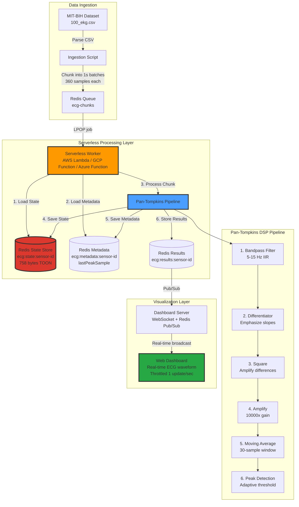

## Data Flow Sequence

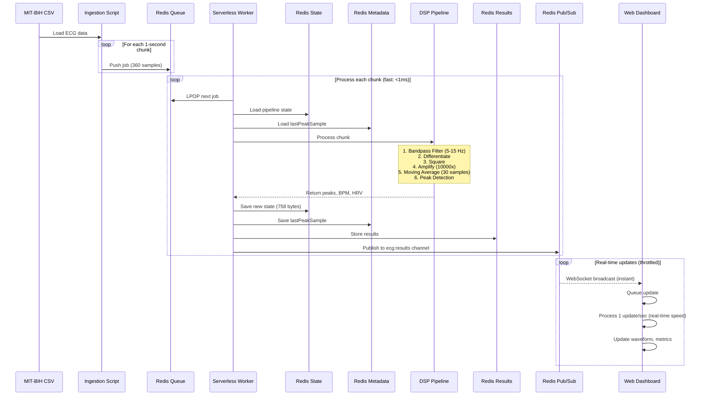

## State Management Deep Dive

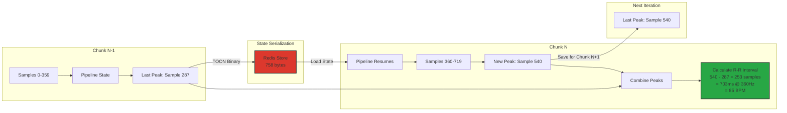

## Pipeline State Composition

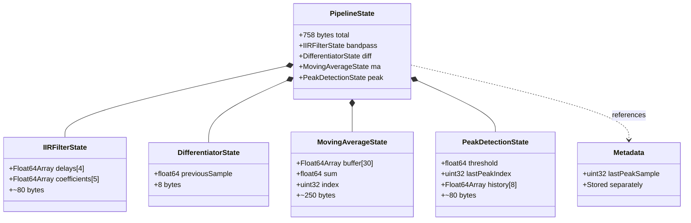

## Deployment Architecture

### AWS Lambda + SQS

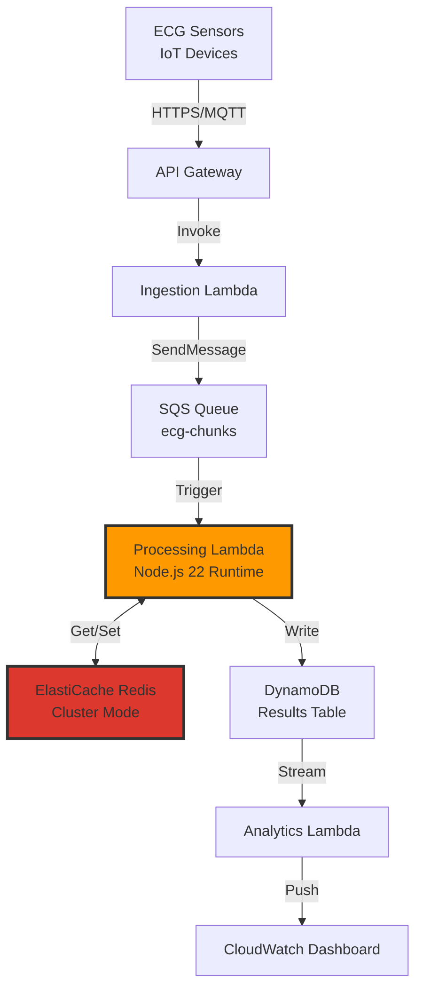

### Google Cloud Functions + Pub/Sub

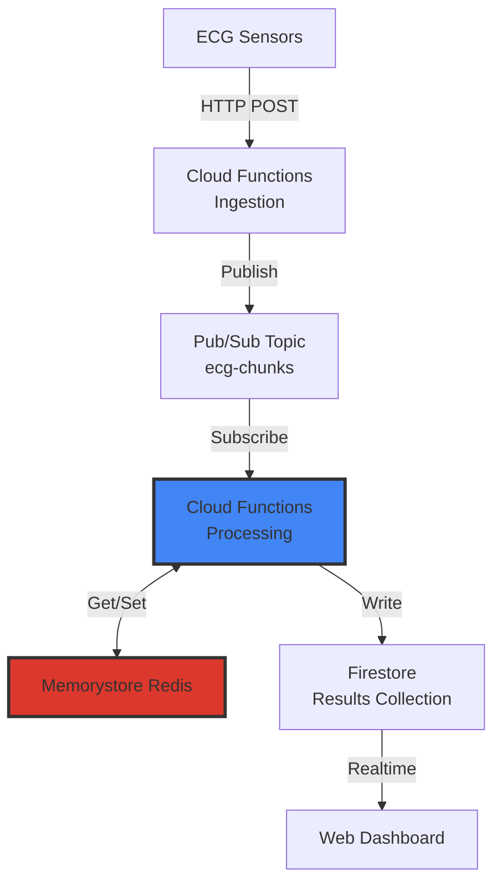

## Performance Characteristics

### Latency Breakdown

```mermaid
gantt
    title Processing Latency per Chunk (Average: 3ms)
    dateFormat X
    axisFormat %L ms

    section Redis I/O
    Load State :0, 1
    Load Metadata :1, 2

    section DSP Processing
    Bandpass Filter :2, 3
    Differentiate + Square :3, 4
    Amplify + MA :4, 5
    Peak Detection :5, 6

    section State Save
    Serialize State :6, 7
    Save to Redis :7, 8
    Save Metadata :8, 9
```

### Scaling Characteristics

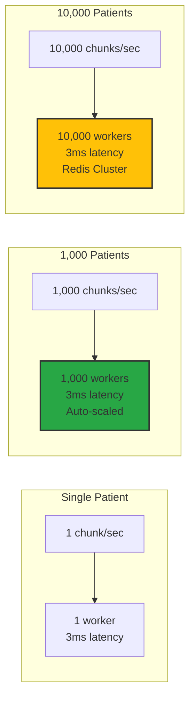

## Cost Analysis

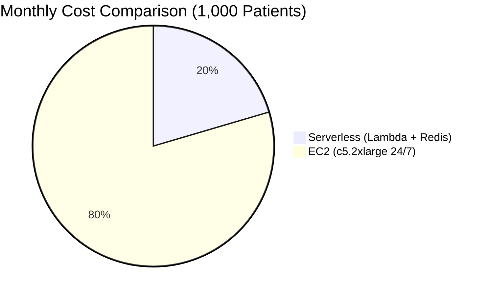

### Detailed Cost Breakdown

**Serverless Architecture** (AWS Lambda + ElastiCache):

- Lambda invocations: 86.4M requests/month × $0.0000002 = $17.28
- Lambda compute: 86.4M × 3ms × $0.0000166667/GB-sec (256MB) = $432
- ElastiCache (t3.medium): $100/month
- Data transfer: ~$200/month
- **Total**: ~$750/month

**Traditional EC2**:

- c5.2xlarge (8 vCPU, 16GB): $0.34/hour × 730 hours = $248.20/month
- 10× instances for redundancy: $2,482/month
- Load balancer: $20/month
- EBS volumes: $100/month
- Monitoring: $50/month
- **Total**: ~$2,920/month

**Savings**: 74% reduction with serverless

## State Format Specification

### TOON Binary Format

```
Offset | Size | Field
-------|------|-------------------------------
0x00   | 4    | Magic bytes: "TOON"
0x04   | 1    | Version: 0x01
0x05   | 2    | NumStages (uint16_le)
0x07   | N    | Stage 1 data
  0x07 | 1    | Type name length
  0x08 | L    | Type name (UTF-8)
  +L   | 4    | Data size (uint32_le)
  +4   | D    | Binary data blob
...    | ...  | Repeat for each stage
```

**Advantages**:

- No string-to-float conversion (preserves precision)
- 94% smaller than JSON (758 vs 12,450 bytes)
- Fast serialization/deserialization (<1ms)
- Deterministic format (bit-exact reproducibility)

## Error Handling & Resilience

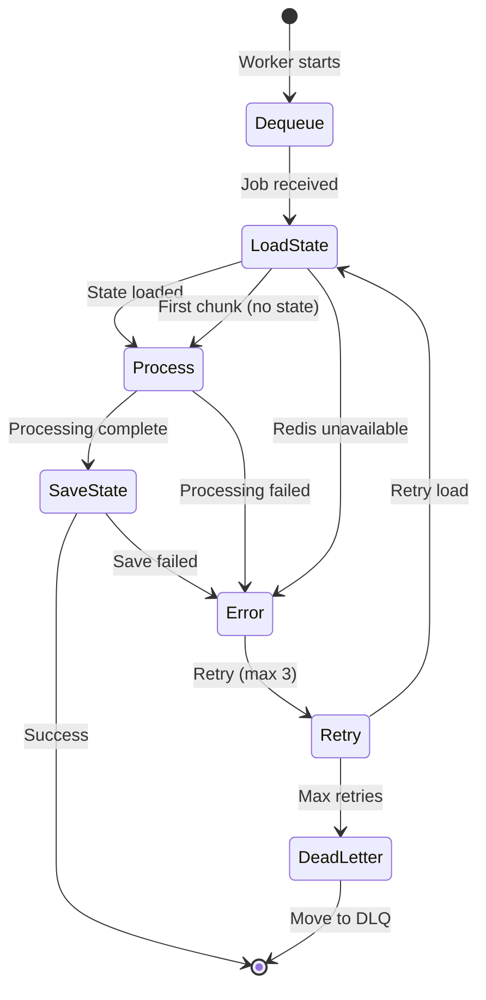

## Production Network Topology

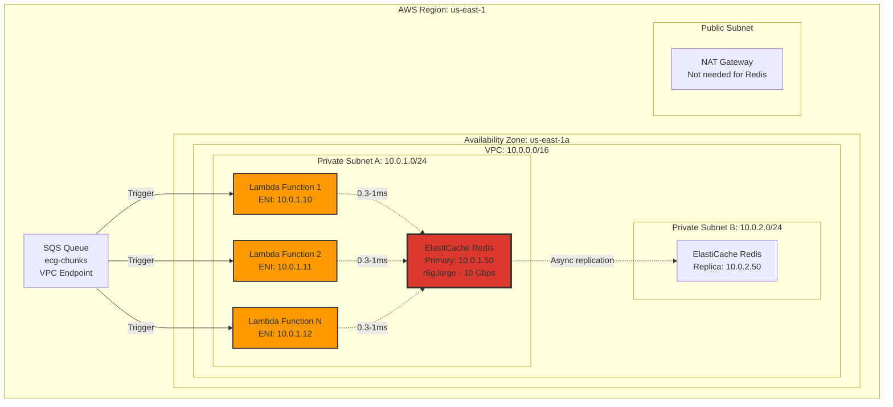

### Network Latency Breakdown

| Operation             | Latency | % of Total | Optimization                              |
| --------------------- | ------- | ---------- | ----------------------------------------- |
| **SQS → Lambda**      | ~10ms   | N/A        | Event-driven (async)                      |
| **Redis: Load State** | 0.5ms   | 12.5%      | ✅ Same AZ, enhanced networking           |
| **DSP Processing**    | 3ms     | 75%        | ✅ Optimized C++ with SIMD                |
| **Redis: Save State** | 0.5ms   | 12.5%      | ✅ Same AZ, pipelining                    |
| **Total Per Chunk**   | **4ms** | 100%       | **Target: <5ms for real-time processing** |

### Critical Network Optimizations

#### 1. **Same-AZ Deployment**

```bash
# WITHOUT same-AZ optimization (different AZs)
Lambda (us-east-1a) ←→ Redis (us-east-1b)
Latency: 2-3ms per operation
Total: 3ms compute + 6ms I/O = 9ms ❌

# WITH same-AZ optimization
Lambda (us-east-1a) ←→ Redis (us-east-1a)
Latency: 0.3-0.5ms per operation
Total: 3ms compute + 1ms I/O = 4ms ✅
```

**Implementation**:

```yaml
# CloudFormation
LambdaFunction:
  Properties:
    VpcConfig:
      SubnetIds:
        - !Ref PrivateSubnetA # Force us-east-1a

RedisCluster:
  Properties:
    PreferredCacheClusterAZs:
      - us-east-1a # Colocate with Lambda
```

#### 2. **Enhanced Network Instance Types**

| Instance Type    | Network Bandwidth | Redis Latency | Cost/Hour |
| ---------------- | ----------------- | ------------- | --------- |
| cache.t3.medium  | Up to 5 Gbps      | 1-2ms         | $0.068    |
| cache.r6g.large  | **10 Gbps**       | **0.3-0.5ms** | $0.201    |
| cache.r6g.xlarge | 12 Gbps           | 0.2-0.4ms     | $0.403    |

**Recommendation**: `cache.r6g.large` for optimal latency/cost ratio

#### 3. **Connection Pooling**

```javascript
// Reuse Redis connection across Lambda invocations
let redisClient;

export async function handler(event) {
  if (!redisClient) {
    redisClient = new Redis({
      host: process.env.REDIS_URL,
      port: 6379,
      keepAlive: 30000, // Keep connection alive
      maxRetriesPerRequest: 1, // Fail fast
      enableOfflineQueue: false, // No queueing
    });
  }

  // Redis client persists across warm invocations
  // Saves ~50ms connection overhead
}
```

#### 4. **VPC Endpoint for SQS** (Optional)

```yaml
SQSEndpoint:
  Type: AWS::EC2::VPCEndpoint
  Properties:
    ServiceName: com.amazonaws.us-east-1.sqs
    VpcId: !Ref VPC
```

**Benefit**: Lambda → SQS traffic stays within VPC (no NAT gateway)

## Security Considerations

- **State Encryption**: Redis data encrypted at rest (ElastiCache encryption)
- **Network Security**: VPC isolation for Lambda + Redis
- **Authentication**: IAM roles for resource access
- **Data Privacy**: PHI-compliant storage (HIPAA-eligible services)
- **Audit Logging**: CloudTrail for all API calls
- **State Validation**: Checksum verification on deserialization

## Monitoring & Observability

**Key Metrics**:

- **Processing latency** (p50, p99, p99.9)
- **Redis latency** (separate from compute time)
  - GET latency (state load)
  - SET latency (state save)
  - Network round-trip time
- **Lambda cold start** (VPC ENI creation: 5-10s)
- **State size over time** (detect memory leaks)
- **Peak detection accuracy** (vs ground truth)
- **Redis hit/miss ratio** (should be 100% hit)
- **Worker invocation count**
- **Queue depth** (SQS)
- **Network metrics**:
  - Lambda → Redis latency (target: <1ms)
  - Cross-AZ traffic (should be 0%)
  - VPC endpoint usage

**CloudWatch Custom Metrics**:

```javascript
await cloudwatch.putMetricData({
  Namespace: "ECG/Processing",
  MetricData: [
    {
      MetricName: "RedisLatency",
      Value: redisLoadTime,
      Unit: "Milliseconds",
      Dimensions: [
        { Name: "Operation", Value: "LoadState" },
        { Name: "AvailabilityZone", Value: "us-east-1a" },
      ],
    },
  ],
});
```

**Alarms**:

- ⚠️ Processing latency > 10ms (2.5× target)
- ⚠️ Redis latency > 2ms (indicates cross-AZ traffic)
- 🚨 State size > 2KB (indicates state bloat/memory leak)
- 🚨 Redis unavailability (automatic failover to replica)
- ⚠️ Queue depth > 1000 (ingestion faster than processing)
- 🚨 Lambda error rate > 1% (state corruption/network issues)
- ⚠️ Cross-AZ data transfer > 0 GB (cost optimization)

---

**Last Updated**: December 2025  
**Version**: 1.0.0  
**Author**: A-KGeorge
